# OpenFeature demo

## Prerequisite
The following tools need to be install on your machine :
- jq
- kubectl
- git
- gcloud ( if you are using GKE)
- Helm


## Deployment Steps in GCP

You will first need a Kubernetes cluster with 2 Nodes.
You can either deploy on Minikube or K3s or follow the instructions to create GKE cluster:
### 1.Create a Google Cloud Platform Project
```shell
PROJECT_ID="<your-project-id>"
gcloud services enable container.googleapis.com --project ${PROJECT_ID}
gcloud services enable monitoring.googleapis.com \
    cloudtrace.googleapis.com \
    clouddebugger.googleapis.com \
    cloudprofiler.googleapis.com \
    --project ${PROJECT_ID}
```
### 2.Create a GKE cluster
```shell
ZONE=europe-west3-a
NAME=isitobservable-openfeature
gcloud container clusters create "${NAME}" \
 --zone ${ZONE} --machine-type=e2-standard-2 --num-nodes=4
```


## Getting started
### 0. Nginx Ingress Controller
```
helm upgrade --install ingress-nginx ingress-nginx  --repo https://kubernetes.github.io/ingress-nginx  --namespace ingress-nginx --create-namespace
```
#### Get Ip adress 
```
IP=$(kubectl get svc ingress-nginx-controller -n ingress-nginx -ojson | jq -j '.status.loadBalancer.ingress[].ip')
```
#### Enable the ssl passthrough
```
kubectl edit deployment ingress-nginx-controller -n ingress-nginx
```
you need to add an extra args to nginx pod:

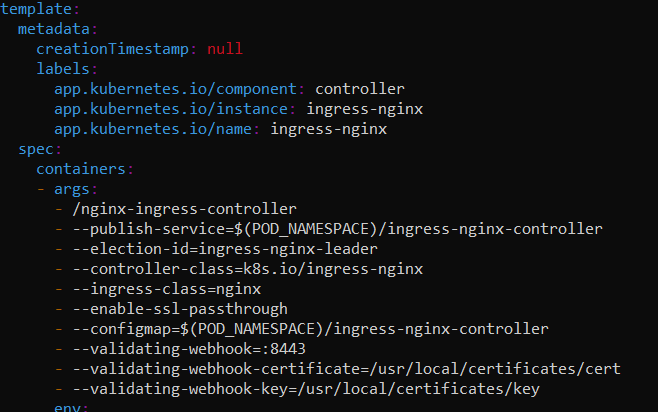

#### Update ingress Rules
```
sed -i "s,IP_TO_REPLACE,$IP," argocd/argo-access-service.yaml
```


### 1. Dynatrace Tenant
#### 1. Dynatrace Tenant - start a trial
If you don't have any Dyntrace tenant , then i suggest to create a trial using the following link : [Dynatrace Trial](https://bit.ly/3KxWDvY)
Once you have your Tenant save the Dynatrace (including https) tenant URL in the variable `DT_TENANT_URL` (for example : https://dedededfrf.live.dynatrace.com)
```
DT_TENANT_URL=<YOUR TENANT URL>
sed -i "s,DT_TENANT_URL_TO_REPLACE,$DT_TENANT_URL," dynatrace/dynakube.yaml
sed -i "s,DT_TENANT_URL_TO_REPLACE,$DT_TENANT_URL," klt/trigger-dt-synthetics-ktd.yaml
```


#### 2. Create the Dynatrace API Tokens
The dynatrace operator will require to have several tokens:
* Token to deploy and configure the various components
* Token to ingest metrics , logs, Traces

##### Token to deploy
Create a Dynatrace token ( left menu Access TOken/Create a new token), this token requires to have the following scope:
* Create ActiveGate tokens
* Read entities
* Read Settings
* Write Settings
* Access problem and event feed, metrics and topology
* Read configuration
* Write configuration
* Paas integration - installer downloader
<p align="center"></p>

Save the value of the token . We will use it later to store in a k8S secret
```
DYNATRACE_API_TOKEN=<YOUR TOKEN VALUE>
```
##### Token to ingest data
Create a Dynatrace token with the following scope:
* Ingest metrics
* Ingest OpenTelemetry traces
* Ingest logs (logs.ingest)
* Ingest events
<p align="center"></p>
Save the value of the token . We will use it later to store in a k8S secret

```
DATA_INGEST_TOKEN=<YOUR TOKEN VALUE>
```
##### Deploy the Dynatrace Operator 
```
kubectl create namespace dynatrace
kubectl apply -f https://github.com/Dynatrace/dynatrace-operator/releases/download/v0.10.2/kubernetes.yaml
kubectl apply -f https://github.com/Dynatrace/dynatrace-operator/releases/download/v0.10.2/kubernetes-csi.yaml
kubectl -n dynatrace wait pod --for=condition=ready --selector=app.kubernetes.io/name=dynatrace-operator,app.kubernetes.io/component=webhook --timeout=300s
kubectl -n dynatrace create secret generic dynakube --from-literal="apiToken=$DYNATRACE_API_TOKEN" --from-literal="dataIngestToken=$DATA_INGEST_TOKEN"
kubectl apply -f dynatrace/dynakube.yaml -n dynatrace
```

### 2. ArgoCD
```
kubectl create namespace argocd
kubectl apply -n argocd -f https://raw.githubusercontent.com/argoproj/argo-cd/stable/manifests/install.yaml
kubectl -n argocd apply -f argo-access-service.yaml
```
Get the ArgoCD password:
```
ARGO_PWD=$(kubectl -n argocd get secret argocd-initial-admin-secret -o jsonpath="{.data.password}" | base64 -d; echo)
```

## Configure ArgoCD (One-off task)

Login and go to `Settings` > `Repositories`

Connect `via HTTPS` to `https://github.com/agardnerIT/openfeature-perform2023` (you will have to fork your own copy)
type: `git`
Create a GitHub PAT token with Repo scope
Project: `default`
Password: `your Git PAT token`

## ArgoCD application for cert-manager (required by KLT) (One-off task)
Go to applications and create application:

```
application name: cert-manager
project name: default
sync policy: manual
repository: you/openfeature-perform2023
revision: HEAD
path: cert-manager
cluster url: https://kubernetes.default.svc
namespace: cert-manager
```
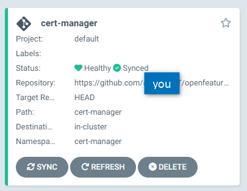

## ArgoCD application for fibonacci (One-off task)
Go to applications and create application:

```
application name: fibonacci
project name: default
sync policy: manual
repository: you/openfeature-perform2023
revision: HEAD
path: fibonacci/helm/fibonacci
cluster url: https://kubernetes.default.svc
```

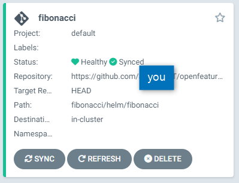

## ArgoCD application for fib3r (One-off task)
Go to applications and create application:

```
application name: fib3r
project name: default
sync policy: manual
repository: you/openfeature-perform2023
revision: HEAD
path: fib3r/helm/fib3r
cluster url: https://kubernetes.default.svc
```

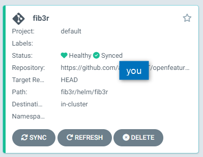

Click create and sync

Check everything works:

`kubectl -n default get pods` should show a `fib3r` pod and a `fibonacci` pod.
`kubectl get services` should show a public LoadBalancer IP for `fib3r`.

The application is deployed and accessible.

## ArgoCD application for Keptn Lifecycle Toolkit (One-off task)

Go to applications and create application:

```
application name: klt
project name: default
sync policy: manual
repository: you/openfeature-perform2023
revision: HEAD
path: klt
cluster url: https://kubernetes.default.svc
namespace: keptn-lifecycle-toolkit-system
```

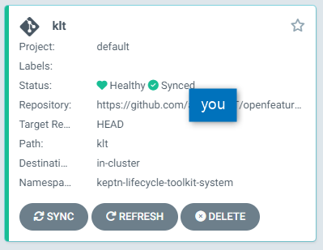

## Webhook.site URL

Go to `https://webhook.site` and get your URL. It should look like: `https://webhook.site/abcd1234-12ab-34cd-abcd-1234abcd1234`

## Update ArgoCD notifications ConfigMap (One-off task)

These files will force argo to notify DT events v2 API (and the webhook.site page for testing purposes) in two cases:

1) Every time argo goes out-of-sync (send a CUSTOM_INFO event)
2) Every time argo goes back in sync (send a CUSTOM_DEPLOYMENT event)

Modify `openfeature-perform2023/argocd/argocd-notifications-secret.yaml` with your details.

```
kubectl -n argocd apply -f openfeature-perform2023/argocd/argocd-notifications-secret.yaml
```

DO NOT COMMIT THIS FILE TO Git. TODO (future): Use sealed-secrets?

Now apply the `notifications-cm.yaml` (as-is because it relies on the secrets ConfigMap you just created)

```
kubectl -n argocd apply -f openfeature-perform2023/argocd/notifications-cm.yaml
```

## Add Notification subscriptions to apps in argo (One-off task)
In argo, modify the `fib3r` app and add a notification subscription:

`notifications.argoproj.io/subscribe.on-out-of-sync-status.webhooksite = ""`

The two double quotes `""` are critical. It won't work without those.

Repeat again for:

```
notifications.argoproj.io/subscribe.on-in-sync-status.webhooksite=""
notifications.argoproj.io/subscribe.on-in-sync-status.dt_service=""
notifications.argoproj.io/subscribe.on-in-sync-status.dt_application=""
notifications.argoproj.io/subscribe.on-in-sync-status.dt_synthetic_test=""
notifications.argoproj.io/subscribe.on-out-of-sync-status.webhooksite=""
notifications.argoproj.io/subscribe.on-out-of-sync-status.dt_service=""
notifications.argoproj.io/subscribe.on-out-of-sync-status.dt_application=""
notifications.argoproj.io/subscribe.on-out-of-sync-status.dt_synthetic_test=""
```

You should have `8` notification subscriptions for `fib3r` now.

Repeat the whole process for the `fibonacci`.

At the end, each app should have `8x` notification subscriptions.

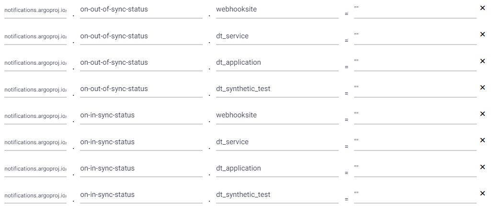


Note: The events won't appear in DT yet because they rely on tag rules that have not yet been applied.
The webhook.site events will work so you can test now:

Change the app color from green to blue. Modify `openfeature-perform2023/fib3r/helm/fib3r/templates/configmap.yaml` line 26 and change `defaultColor` to something else.

```
git add fib3r/*
git commit -sm "update app color"
git push
```

Click refresh and app should go "out of sync". A notification should appear in `webhook.site`.

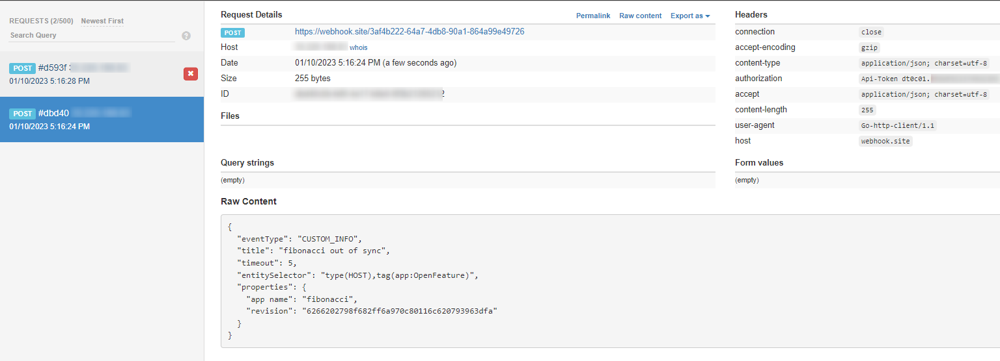

Sync the application and you should see a second notification on `webhook.site`.

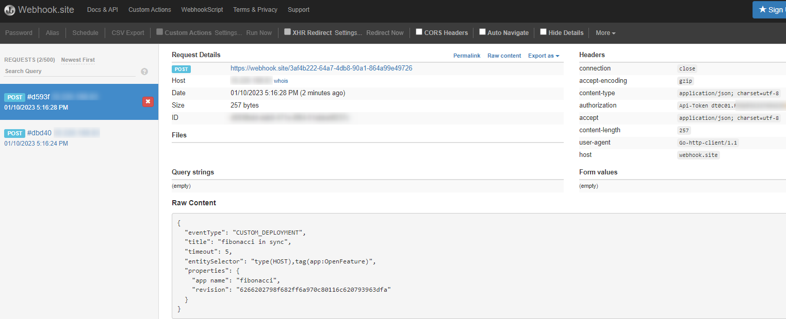

## Apply Dynatrace Configuration (One-off task)

Create a DT Access token with:

- `ReadConfig`
- `WriteConfig`
- `ExternalSyntheticIntegration`
- `CaptureRequestData`
- `settings.read`
- `settings.write`
- `syntheticExecutions.write`
- `syntheticExecutions.read`
- `events.ingest`
- `events.read`

```
cd openfeature-perform2023/dt_setup
chmod +x setup.sh
./setup.sh https://abc12345.live.dynatrace.com dt01c01.sample.secret
```

This script:
- Downloads `jq`
- Retrieves the K8S integration details setup when the OneAgent dynakube was installed
- Enables k8s events integration
- Configures DT to capture 3x span attributes: `feature_flag.flag_key`, `feature_flag.provider_name` and `feature_flag.evaluated_variant`
- Downloads the `monaco` binary
- Uses `sed` to get and replace the public LoadBalancer IP in the monaco template files (for app detection rule and synthetics)

Then the script uses monaco to create:

- 1x application called `OpenFeature` with User Action properties linked to the serverside request attributes
- 1x application url rule that maps the public LoadBalancer IP to the `OpenFeature` application
- 1x management zone called `openfeature`
- 1x auto-tag rule which adds `app: OpenFeature` tag to the application and synthetics
- 4x request attributes: `feature_flag.evaluated_variant`, `feature_flag.provider_name`, `feature_flag.flag_key` and `fibn` (captures query param for the number that fib is being calculated)
- 2x synthetic monitors: `OpenFeature Default` and `OpenFeature Logged In` (running on-demand only) (Note: the GEOLOCATION ID is currently set to a sprint one - TODO variabilise this)

## Out-of-sync and In-sync events on DT Service
Now that DT is configured, each time Argo goes out-of-sync or back in-sync, you should see events on the DT `openfeature` service:

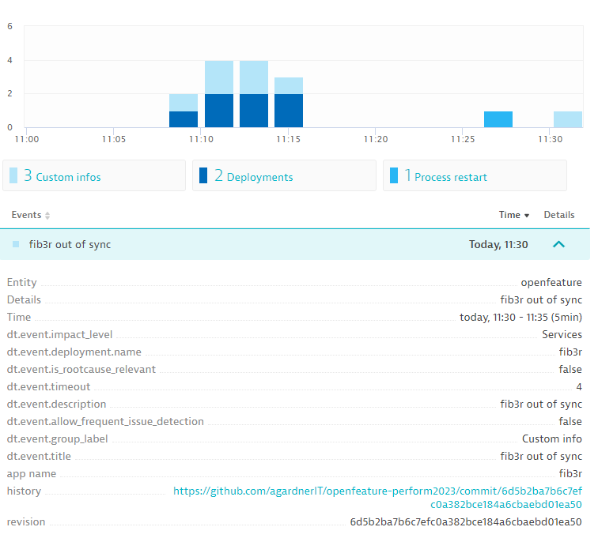
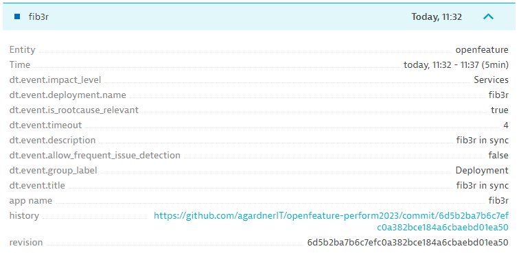

## KLT Toolkit working for fib3r

- KLT: Find a way to trigger on-demand synthetics from a post-deploy task
- KLT: Find out how to pull metrics from DT
- Playground app: Modify CM so rule is `UserAgent in DynatraceSynthetic` and set it up so `DynatraceSynthetic` uses `remote service`
- Playground app: Modify CM so remote service password is wrong to start with (this won't affect any real users)

## Install otel collector

1. Make a note of your DT tenant URL like: `https://abc12345.live.dynatrace.com` (no trailing slash)
2. Create a `ConfigMap` with the following:

```
cat <<EOF > otel-collector-configmap.yaml
apiVersion: v1
kind: ConfigMap
metadata:
  name: otel-collector-conf
  namespace: keptn-lifecycle-toolkit-system
  labels:
    app: opentelemetry
    component: otel-collector-conf
data:
  otel-collector-config: |
    receivers:
      # Make sure to add the otlp receiver.
      # This will open up the receiver on port 4317
      otlp:
        protocols:
          grpc:
            endpoint: "0.0.0.0:4317"
      prometheus:
        config:
          scrape_configs:
            - job_name: 'otel-collector'
              scrape_interval: 5s
              static_configs:
                - targets: ['klc-controller-manager-metrics-service:2222']
    processors:
    extensions:
      health_check: {}
    exporters:
      otlphttp:
        endpoint: "DT_TENANT_URL_TO_REPLACE/api/v2/otlp"
        headers:
          Authorization: "Api-Token API_TOKEN_TO_REPLACE"
      jaeger:
        endpoint: "otel-collector:14250"
        tls:
          insecure: true
      prometheus:
        endpoint: 0.0.0.0:8889
      logging:
    service:
      extensions: [health_check]
      pipelines:
        traces:
          receivers: [otlp]
          processors: []
          exporters: [jaeger, otlphttp]
        metrics:
          receivers: [otlp,prometheus]
          processors: []
          exporters: [prometheus, logging, otlphttp]
EOF
```

3. Modify that file and replace `DT_TENANT_URL` with your DT tenant URL : $DT_TENANT_URL
   The final URL should look like: `https://abc12345.live.dynatrace.com/api/v2/otlp`

4. Modify that file and replace `Api-Token API_TOKEN_TO_REPLACE`. with the variable : $DATA_INGEST_TOKEN
5. Create the `ConfigMap`: `kubectl apply -f otel-collector-configmap.yaml`
6. Create a new app in argo. Point it to the `observability` folder.

## Deploy Prometheus

Deploy Prometheus to ingest metrics from KLT to Dynatrace.

1. Create a new Argo App called `prometheus`
2. project = default
3. namespace = `monitoring`
4. repo url = `https://github.com/prometheus-community/helm-charts`
5. path = `charts/prometheus`

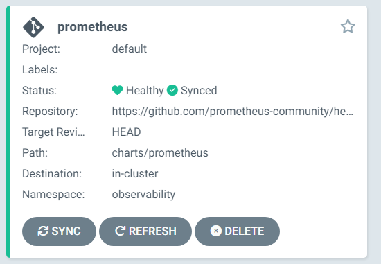

## Grafana
Grafana is available via a LoadBalancer on port 3000.

Initial login is `admin` / `admin` but then it prompts to reset password.

```
http://35.193.247.69:3000/
```


## Dynatrace Gen3 Notebook

*n Deployments*
```
fetch events
| filter `event.type` == "CUSTOM_DEPLOYMENT"
| summarize count()
```

*n out-of-sync(s)*
```
fetch events
| filter `event.type` == "CUSTOM_INFO"
| filter `app name` == "fib3r"
| filter contains(`event.name`,"out of sync")
| summarize count()
```
